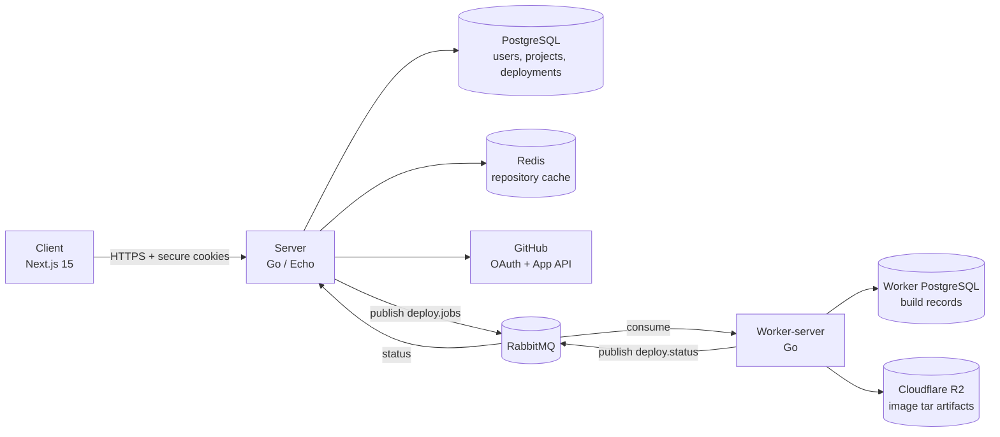
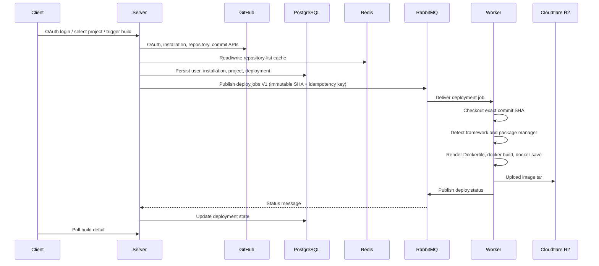
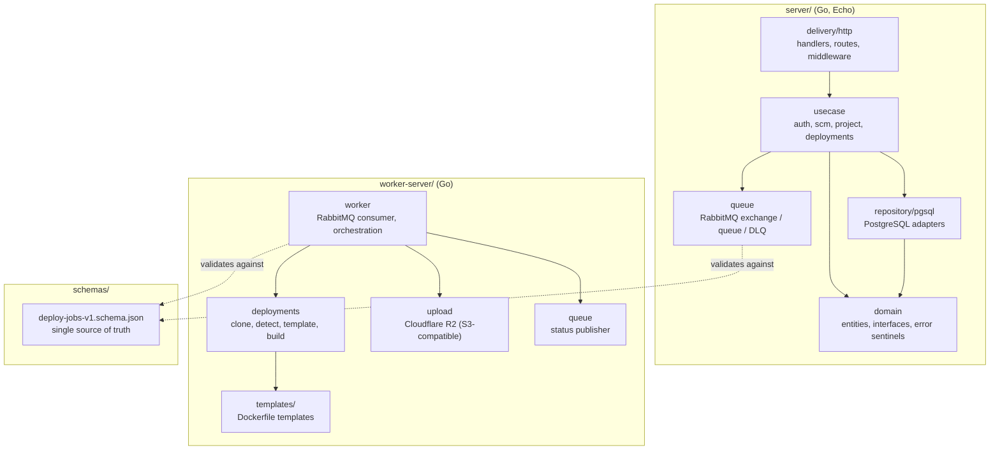

# Zero-DevOps

> A platform that removes the DevOps layer so developers can focus on building products.

Zero-DevOps takes a GitHub repository, resolves it to an immutable commit, builds it in an
isolated worker, and tracks the whole run as a durable, queryable deployment record. You
connect a GitHub App, pick a repository, and the platform handles detection, containerization,
and artifact storage.

**Status:** active development. Auth, GitHub App installation, repository selection, project
CRUD, manual builds, and the worker build pipeline are working end to end. The outbox dispatcher
is wired in and the only `deploy.jobs` producer. Webhook-triggered builds and the Buildah
executor are in progress. See [Project Status](#project-status) for the exact breakdown.

---

## Table of contents

- [Why this exists](#why-this-exists)
- [Architecture](#architecture)
- [Workspaces](#workspaces)
- [Tech stack](#tech-stack)
- [Getting started](#getting-started)
- [API surface](#api-surface)
- [Data model](#data-model)
- [Shared contract](#shared-contract)
- [Project status](#project-status)
- [Projected direction](#projected-direction)
- [Documentation](#documentation)
- [Contributors](#contributors)

---

## Why this exists

Shipping a small application still means writing a Dockerfile, wiring CI, managing registry
credentials, configuring a queue, and debugging build reproducibility. Most of that work is
identical across projects and none of it is the product.

Zero-DevOps takes an opinionated position on each of those decisions:

- **Builds are immutable.** Every build is keyed by `(repository, ref, commit_sha, configuration_version, trigger)`. The worker never builds a moving branch tip.
- **The queue is the boundary.** The API server never builds. It validates, persists, and publishes a job. The worker never talks to the client.
- **Contracts are versioned files, not conventions.** The `deploy.jobs` V1 message lives in a JSON Schema that both Go services compile against and validate in conformance tests.
- **Framework detection replaces configuration.** The worker detects the framework and package manager, then renders a Dockerfile from a template unless the repository ships its own.

---

## Architecture

The system is four workspaces: a Next.js client, a Go API server, a Go build worker, and a
shared schema package. The client only ever talks to authenticated server APIs — never to
GitHub, RabbitMQ, or PostgreSQL directly.

### Current system



### Build lifecycle



### Layered structure

Both Go services use a clean-architecture package layout, so the delivery mechanism, business
rules, and persistence are independently replaceable.



Full detail, including the planned target architecture, lives in
[`docs/architecture.md`](docs/architecture.md).

---

## Workspaces

| Workspace | Purpose |
| --- | --- |
| `client/` | Next.js 15 web UI — landing page and authenticated app shell. |
| `server/` | Go (Echo) API server — auth, GitHub integration, projects, deployments, queueing. |
| `worker-server/` | Go build worker — consumes deployment jobs, builds images, uploads artifacts. |
| `schemas/` | Shared versioned contracts (the `deploy.jobs` V1 JSON Schema and fixtures). |
| `docs/` | Architecture, plans, contracts, and status notes. |

### Server packages

| Package | Responsibility |
| --- | --- |
| `internal/auth` | GitHub OAuth login/refresh/logout/current-user, JWT session cookies, auth middleware. |
| `internal/integrations/scm` | GitHub App installation lifecycle, installation-token provider, repository listing, webhook parser. |
| `internal/project` | Selected-project CRUD, branch/command configuration, command scanner and policy. |
| `internal/deployments` | Deployment records, manual builds, V1 `deploy.jobs` contract, queue setup. |
| `internal/queue` | RabbitMQ exchange, queue, and DLQ declaration. |
| `internal/domain` | Shared entities, interfaces, error sentinels. |
| `config`, `internal/logger`, `internal/middleware`, `internal/helper` | Viper config, Zap structured logging, CORS/request-ID/logging middleware, response envelope helpers. |

### Worker packages

| Package | Responsibility |
| --- | --- |
| `internal/worker` | RabbitMQ consumer and deployment job orchestration. |
| `internal/deployments` | Exact-SHA cloning, framework detection, Dockerfile templating, Docker build, image tar save. |
| `internal/deployments/contract` | V1 `deploy.jobs` contract mirror, validated against the shared schema. |
| `internal/queue` | RabbitMQ queue bindings and status publisher. |
| `internal/upload` | Image tar upload to Cloudflare R2. |
| `templates/` | Dockerfile templates per detected framework. |

---

## Tech stack

**Client** — Next.js 15, React 19, TypeScript (strictest config), Tailwind CSS, shadcn/ui
(New York), Radix UI, Zustand, TanStack Query, React Hook Form, Zod, Axios, next-themes,
Framer Motion, Lucide React, CVA.

**Server and worker** — Go 1.25, Echo, PostgreSQL, Redis, RabbitMQ, Viper, Zap, Goose
migrations, golangci-lint, gotestsum, mockery, Air for hot reload.

**Infrastructure** — Docker and Docker Compose, Cloudflare R2 (S3-compatible object storage),
GitHub App and OAuth, GitHub Actions CI with path filters.

---

## Getting started

### Prerequisites

- Go 1.25+
- Node.js 20+
- Docker and Docker Compose
- A GitHub App with OAuth credentials and a private key

### 1. Server

```bash
cd server
cp .env.example .env          # fill OAuth, GitHub App, DB, RabbitMQ, Redis values
make install-deps             # goose, air, gotestsum, tparse, mockery
make dev-env                  # start PostgreSQL + RabbitMQ via Docker Compose
make migrate-up               # apply Goose migrations
make up                       # run the API server with hot reload (Air)
```

Default address is `127.0.0.1:8750`. The GitHub App private key path is read from
`GITHUB_APP_PRIVATE_KEY_PATH`.

### 2. Worker

```bash
cd worker-server
cp .env.example .env          # fill DB, RabbitMQ, Cloudflare R2 credentials
make dev-env                  # start worker PostgreSQL + RabbitMQ
make migrate-up
make up                       # run the worker with hot reload
```

The worker needs a reachable Docker daemon to run builds.

### 3. Client

```bash
cd client
cp .env.example .env.local    # set NEXT_PUBLIC_API_URL to the server address
npm install
npm run dev
```

Open http://localhost:3000.

### Verification commands

| Workspace | Commands |
| --- | --- |
| `server/` | `make lint`, `go vet ./...`, `make tests`, `make build` |
| `worker-server/` | `make lint`, `go vet ./...`, `make tests`, `make build` |
| `client/` | `npm run lint`, `npm run typecheck`, `npm run build` |

CI runs the same checks per workspace using path filters, plus a dedicated
`deploy.jobs` schema conformance test.

---

## API surface

All routes are cookie-authenticated unless noted. Session cookies are `access_token` and
`refresh_token`.

**Auth**

| Method | Path | Purpose |
| --- | --- | --- |
| `GET` | `/auth/github/login` | Start OAuth, set state cookie, redirect to GitHub. |
| `GET` | `/auth/github/login/callback` | Exchange code, issue session cookies. |
| `POST` | `/auth/refresh` | Rotate session tokens. |
| `POST` | `/auth/logout` | Clear session and cookies. |
| `GET` | `/auth/user/me` | Current user. |

**GitHub integration**

| Method | Path | Purpose |
| --- | --- | --- |
| `GET` | `/integrations/github/installation` | Installation record and status. |
| `GET` | `/integrations/github/repositories` | Paginated repository picker (Redis-cached). |
| `POST` | `/integration/scm/github/install` | Install GitHub App from OAuth code (legacy path). |
| `GET` | `/integration/scm/github/` | Stored installation (legacy path). |
| `DELETE` | `/integration/scm/github/delete` | Disconnect installation (legacy path). |

**Projects**

| Method | Path | Purpose |
| --- | --- | --- |
| `GET` / `POST` | `/projects` | List and create selected projects. |
| `GET` / `PATCH` / `DELETE` | `/projects/:id` | Read, update, delete a project. |

**Builds**

| Method | Path | Purpose |
| --- | --- | --- |
| `POST` | `/projects/:id/builds` | Manual build — resolves ref to an immutable SHA, snapshots config, publishes a V1 job. |
| `GET` | `/projects/:id/builds` | Build history for a project. |
| `GET` | `/builds/:id` | Build detail. |
| `POST` | ~~`/deploy`~~ | **Removed** (2026-09-06). Use `POST /projects/:id/builds`. |

---

## Data model

Server PostgreSQL, managed with forward-only Goose migrations:

| Table | Contents |
| --- | --- |
| `users` | OAuth user identity and refresh token. |
| `github_installations` | Installation ID, account, `status` (`active` / `suspended` / `uninstalled`), unique per user and per installation. |
| `projects` | Selected repository, branch, webhook flag, build configuration, scanner result, generation counter. |
| `deployments` | Build runs linked to project and installation, with full V1 fields (SHA, ref, trigger, config snapshot, idempotency key). |
| `webhook_deliveries` | GitHub delivery ID dedup and audit trail. |
| `deployment_outbox` | Durable outbox for build jobs — dispatcher running, publishes with broker confirmation after DB commit. |

The worker keeps its own PostgreSQL database for worker-side build records and logs.

---

## Shared contract

`schemas/deploy-jobs-v1.schema.json` is the single source of truth for the RabbitMQ
`deploy.jobs` message. Both Go services compile against that file and validate it in
conformance tests, so a schema change that breaks either service fails CI.

V1 is immutable. A future V2 would ship alongside V1 for a bounded migration window rather
than replacing it. `deploy.status` is a separate, deliberately looser contract.

Details in [`docs/deploy-jobs-contract.md`](docs/deploy-jobs-contract.md).

---

## Project status

### Working

- **Auth** — GitHub OAuth login, callback, refresh, logout, current-user; JWT session cookies; auth middleware with public-path skipping.
- **GitHub installation** — install, get, delete, with `status` tracking.
- **Repository picker** — paginated, Redis-cached, single-flight, installation-scoped.
- **Projects** — full CRUD with branch config, webhook flag, command scanning and policy, unique `(user, repo)` selection.
- **Manual builds** — ref resolved to an immutable SHA, config snapshotted, V1 job published.
- **V1 contract** — shared JSON Schema plus Go contract packages in both services, with conformance tests.
- **Worker** — consumes V1 jobs, checks out exact SHA, detects framework and package manager, builds with Docker, uploads the image tar to R2, publishes status.
- **Migrations** — users, installations, deployments, projects, webhook deliveries, outbox schema.
- **CI** — path-filtered server, worker, and client jobs (lint, vet, schema conformance, test, build).

### In progress

- **Webhook ingress** — parser and stub handler exist and `/webhooks/github` is already public in middleware, but the handler is not yet wired in `main.go`.
- **Client UI** — landing page, app shell, auth guard and session, dashboard/deployments/settings shells are in place; project picker, project form, and build views are not built yet.

### Planned

- Webhook to lifecycle status wiring (`suspend`, `unsuspend`, `deleted`).
- Webhook push events creating builds from the exact `after` SHA, with stale-generation coalescing.
- Webhook-driven Redis cache invalidation (method exists, not yet called).
- Outbox dispatcher with publisher confirms and idempotent delivery.
- Reliable status consumption (durable consumer landed: manual ack after atomic `ApplyStatusUpdate`, poison/permanent dead-lettering to `deploy.status.dlq`, bounded transient retry, restart loop with backoff; real-broker failure-recovery tests still pending).
- Buildah executor with rootless builds and resource isolation, replacing Docker.
- Registry push by digest, replacing the local tar to R2 path.
- Build-log retrieval endpoint with signed log URLs.
- Autoscan command suggestions surfaced and confirmed in the client.
- End-to-end rollout, staging ingress, and load plus observability validation.

### Known gaps

- Legacy `POST /deploy` **removed** (2026-09-06, together with `CreateDeployment` and the dead `Store`/`StoreProjectBuild` repo methods); legacy SCM routes still coexist with the newer `/integrations/...` routes.
- Refresh tokens are stored raw and need hashing before production.
- `StoreInstallation` is a plain insert; reinstall should be an upsert.
- Worker ack, retry, and DLQ policy is not yet the final reliable path.

---

## Projected direction

The target is a reliable, queue-driven pipeline that accepts webhook-triggered and manual
builds, builds in an isolated rootless worker, and publishes immutable digest-addressed OCI
images.

```mermaid
flowchart LR
    GH["GitHub App<br/>webhook"] -->|"POST /webhooks/github"| Ingress["Webhook ingress<br/>raw body + HMAC validation"]
    Ingress --> Dedup["Delivery deduplication<br/>X-GitHub-Delivery"]
    Dedup --> State["PostgreSQL transaction<br/>lifecycle + project + deployment"]
    State --> Outbox["Deployment outbox"]
    Outbox -->|"publisher confirms"| MQ[("RabbitMQ<br/>deploy.jobs")]
    MQ --> Claim["Isolated build worker<br/>manual ack + bounded concurrency"]
    Claim --> Checkout["Checkout exact<br/>commit SHA"]
    Checkout --> Config["Approved config<br/>or scanner fallback"]
    Config --> Build["Buildah executor<br/>rootless + resource limits"]
    Build --> Result["Image digest +<br/>bounded build logs"]
    Result --> Status["Durable deploy.status<br/>state transition"]
    Status --> State
    Result --> Registry[("OCI registry<br/>publish by digest")]
    Client["Client UI"] -->|"authenticated API"| State
    Client -->|"poll / reconnect"| Status
```



The eight boundaries that define the target design:

1. **Webhook ingress** — public `POST /webhooks/github`, HMAC `X-Hub-Signature-256` verification, `X-GitHub-Delivery` dedup, event allowlist (`push`, `installation`, `installation_repositories`), strict body size limit, no synchronous build.
2. **Lifecycle sync** — `installation.suspend` sets `suspended`, `unsuspend` restores `active`, `deleted` sets `uninstalled`; history is preserved and new builds are blocked while inactive.
3. **Repository inventory** — GitHub is the source of inventory, Redis caches picker pages (5–15 min TTL, webhook-invalidated), PostgreSQL persists only *selected* projects.
4. **Reliable delivery** — outbox dispatcher with publisher confirms, idempotent status transitions, retry with backoff, DLQ.
5. **Immutable builds** — every build keyed by `(repository, ref, commit_sha, configuration_version, trigger)`; the worker never builds a moving branch tip.
6. **Build executor** — Buildah behind a `BuildExecutor` interface, rootless, with per-job timeouts and CPU, memory, PID, and disk limits, plus workspace isolation and cleanup.
7. **Image and registry abstraction** — `ImageStore` / `ImagePublisher` interfaces; local Buildah storage first, registry push by digest later.
8. **Client UI** — authenticated app shell, connection screen, cached repository picker, project form, manual-build form, build detail and status views (polling first, SSE or WebSocket later).

The full roadmap, phase ordering, and definition of done live in
[`docs/projected-direction.md`](docs/projected-direction.md). Supporting plans and open
questions are in
[`docs/plan-server-12-08.md`](docs/plan-server-12-08.md),
[`docs/plan-outbox-dispatcher.md`](docs/plan-outbox-dispatcher.md), and
[`docs/buildah-webhook-worker-architecture.md`](docs/buildah-webhook-worker-architecture.md).

---

## Documentation

| Document | Contents |
| --- | --- |
| [`docs/architecture.md`](docs/architecture.md) | Current and planned architecture, data model, completion status. |
| [`docs/projected-direction.md`](docs/projected-direction.md) | Roadmap: end state, gap analysis, phased plan, contract policy. |
| [`docs/auth.md`](docs/auth.md) | Auth flow and session design. |
| [`docs/deploy-jobs-contract.md`](docs/deploy-jobs-contract.md) | `deploy.jobs` V1 contract rules and versioning policy. |
| [`docs/buildah-webhook-worker-architecture.md`](docs/buildah-webhook-worker-architecture.md) | Deep design for webhook ingress and the Buildah-based worker. |
| [`docs/plan-server-12-08.md`](docs/plan-server-12-08.md) | Sequenced implementation plan across server, client, and worker. |
| [`docs/plan-outbox-dispatcher.md`](docs/plan-outbox-dispatcher.md) | Outbox dispatcher design with publisher confirms. |
| [`docs/task2status.md`](docs/task2status.md) | Task-to-status mapping and progress tracking. |
| [`docs/webhook_todos.md`](docs/webhook_todos.md) | Remaining webhook work items. |
| [`docs/revise.md`](docs/revise.md) | Dated engineering log of decisions and revisions. |
| [`docs/future/`](docs/future) | Forward-looking notes: GitHub integration, open issues, webhook implementation. |
| [`server/README.md`](server/README.md) | Server-specific setup and runtime flow. |
| [`client/README.md`](client/README.md) | Client stack, structure, and conventions. |

---

## Contributors

Developed by:

- [@Parth06102006](https://github.com/Parth06102006)
- [@dkhushi6](https://github.com/dkhushi6)
