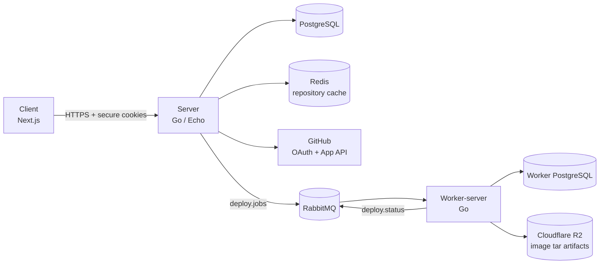
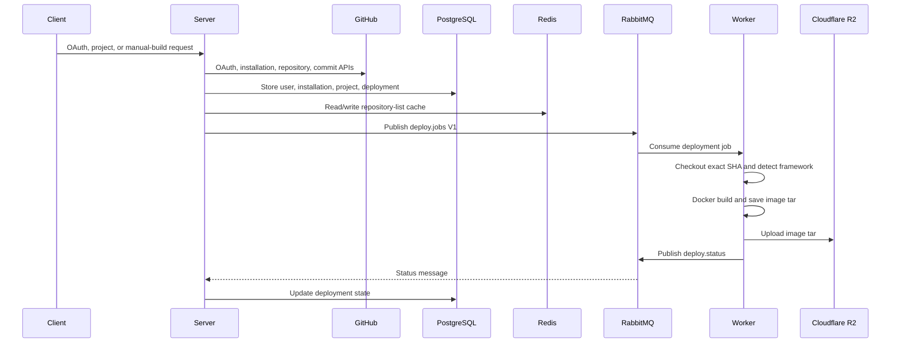
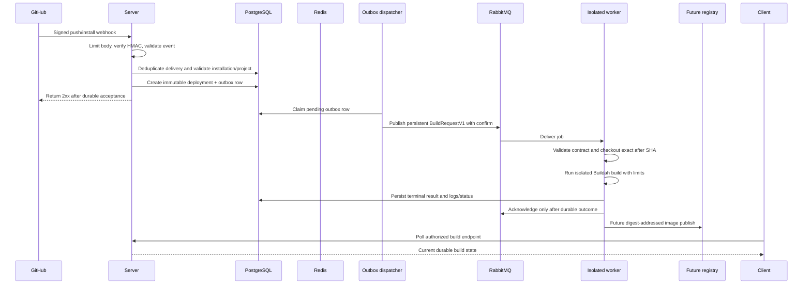

# Zero-DevOps Architecture

> Zero-DevOps removes the DevOps layer so developers can focus on building products.
> This document captures the **current** implementation and the **planned** target
> architecture, followed by a project completion status snapshot.

The codebase is split into four top-level workspaces:

| Workspace | Purpose |
| --- | --- |
| `client/` | Next.js 15 web UI (landing page + authenticated app shell). |
| `server/` | Go (Echo) API server — auth, GitHub integration, projects, deployments, queueing. |
| `worker-server/` | Go build worker — consumes deployment jobs, builds, uploads artifacts. |
| `schemas/` | Shared versioned contracts (currently the `deploy.jobs` V1 JSON Schema). |

The two Go services use clean-architecture-style package layout (`domain`, `usecase`,
`repository`, `delivery/http`) and share a RabbitMQ build-job bus and a PostgreSQL
database. The client never talks to GitHub, RabbitMQ, or PostgreSQL directly; it only
calls authenticated `server` APIs.

---

## 1. Current Setup

### 1.1 Runtime components

```
Client (Next.js)
   |
   | HTTPS + cookies (access_token / refresh_token)
   v
Server (Go/Echo)
   |-- PostgreSQL   (users, github_installations, projects, deployments, webhook_deliveries, deployment_outbox)
   |-- Redis        (repository-list cache only)
   |-- RabbitMQ     (deploy.jobs / deploy.status command bus)
   |-- GitHub       (OAuth + GitHub App installation + repositories)
   ^
   | deploy.jobs (RabbitMQ)
   |
Worker-server (Go)
   |-- PostgreSQL   (worker-side deployment records)
   |-- RabbitMQ     (deploy.jobs consumer / deploy.status publisher)
   `-- Cloudflare R2 (S3-compatible artifact upload)
```



**Current request flow**



### 1.2 Server layout (`server/`)

| Package | Responsibility |
| --- | --- |
| `internal/auth` | GitHub OAuth login/refresh/logout/current-user, JWT session cookies, auth middleware. |
| `internal/integrations/scm` | GitHub App installation lifecycle, installation-token provider, repository listing, webhook parser/delivery. |
| `internal/project` | Selected-project CRUD, branch/command configuration, command scanner/policy. |
| `internal/deployments` | Deployment records, manual/webhook project builds, V1 `deploy.jobs` contract, RabbitMQ queue setup. |
| `internal/queue` | RabbitMQ exchange/queue/DLQ declaration. |
| `internal/domain` | Shared entities, interfaces, error sentinels. |
| `config`, `internal/logger`, `internal/middleware`, `internal/helper` | Config (Viper), structured logging (Zap), CORS/request-ID/request-logger, response envelope helpers. |

Current server HTTP surface:

- Auth (cookie-based, GitHub OAuth only)
  - `GET /auth/github/login` — start OAuth, set state cookie, redirect to GitHub.
  - `GET /auth/github/login/callback` — exchange code, issue `access_token`/`refresh_token` cookies.
  - `POST /auth/refresh` — rotate session tokens.
  - `POST /auth/logout` — clear session + cookies.
  - `GET /auth/user/me` — current user.
- GitHub integration
  - `POST /integration/scm/github/install` — install GitHub App from OAuth code (legacy path).
  - `GET /integration/scm/github/` — stored installation (legacy path).
  - `DELETE /integration/scm/github/delete` — disconnect installation (legacy path).
  - `GET /integrations/github/installation` — installation/status (new path).
  - `GET /integrations/github/repositories` — paginated repository picker (Redis-cached).
- Projects
  - `GET /projects`, `POST /projects`
  - `GET /projects/:id`, `PATCH /projects/:id`, `DELETE /projects/:id`
- Builds
  - `POST /projects/:id/builds` — manual build (immutable SHA + idempotency key).
  - `GET /projects/:id/builds` — build history for a project.
  - `GET /builds/:id` — build detail.
  - ~~`POST /deploy`~~ — Removed (2026-09-06): route, handler, DTO, usecase path,
    and repository stores were deleted; all builds flow through
    `POST /projects/:id/builds` or the webhook.
- Webhooks
  - `POST /webhooks/github` — public (HMAC-verified) GitHub App event ingress;
    push events create builds transactionally via the outbox.

### 1.3 Worker layout (`worker-server/`)

| Package | Responsibility |
| --- | --- |
| `internal/worker` | RabbitMQ consumer, deployment job orchestration. |
| `internal/deployments` | Cloning exact commit SHA, framework detection, Dockerfile templating, Docker build, image tar save. |
| `internal/queue` | RabbitMQ queue/status publisher. |
| `internal/upload` | Upload image tar to Cloudflare R2 (S3-compatible). |
| `internal/deployments/contract` | V1 `deploy.jobs` contract mirror (validated against shared schema). |
| `templates/` | Dockerfile templates for detected frameworks. |

Current worker flow: consume `deploy.jobs` (manual ack, prefetch 1) → validate V1 →
insert/reset its own `deployments` row → publish `building` → clone exact `commit_sha` →
detect framework/package manager → write Dockerfile from template (or use existing) →
`docker build` → `docker save` to tar → upload tar to R2 → update its own DB →
publish status (`failed`/`canceled`; `success` is NOT yet published — see gaps).

> Important: the worker still uses **Docker** for builds, not Buildah, and produces a
> node-local image tar rather than pushing an OCI image to a registry.

### 1.4 Data model (server PostgreSQL)

- `users` — OAuth user identity, refresh token.
- `github_installations` — installation ID, account, `status` (`active`/`suspended`/`uninstalled`), unique per `user_id` and per `installation_id`.
- `projects` — selected/configured repository, branch, webhook flag, build configuration, scanner result, generation counter.
- `deployments` — build runs, linked to project/installation, full V1 fields (SHA, ref, trigger, config snapshot, idempotency key).
- `webhook_deliveries` — GitHub delivery ID dedup/audit.
- `deployment_outbox` — durable outbox for build jobs (claimed/published with RabbitMQ publisher confirms by the running dispatcher; status `pending`/`sent`/`dead`).

### 1.5 Shared contract

`schemas/deploy-jobs-v1.schema.json` is the single source of truth for the RabbitMQ
`deploy.jobs` message. Both Go services compile against the same file and validate it
in conformance tests. V1 is immutable; `deploy.status` is a separate, looser contract.

---

## 2. Planned Setup

The target is a reliable, queue-driven build pipeline that accepts webhook-triggered
and manual builds, builds in an isolated worker, and eventually publishes immutable
OCI images.

### 2.1 Target runtime

```
GitHub App webhook
   -> server POST /webhooks/github (HMAC-verified, unauthenticated except signature)
   -> delivery dedup + ownership/ref validation
   -> transactional outbox (PostgreSQL)
   -> RabbitMQ deploy.jobs (publisher confirms)
   -> worker claims job
   -> checkout exact commit SHA
   -> resolve explicit command or scanner fallback
   -> isolated Buildah build (rootless, resource-limited)
   -> local image + digest (not yet portable)
   -> publish deploy.status + build logs
   -> finalize deployment record
```



```mermaid
flowchart LR
    GH[GitHub App\nwebhook] -->|POST /webhooks/github| Ingress[Webhook ingress\nraw body + HMAC validation]
    Ingress --> Dedup[Delivery deduplication\nX-GitHub-Delivery]
    Dedup --> State[PostgreSQL transaction\nlifecycle + project + deployment]
    State --> Outbox[Deployment outbox]
    Outbox -->|publisher confirms| MQ[(RabbitMQ\ndeploy.jobs)]
    MQ --> Claim[Isolated build worker\nmanual ack + bounded concurrency]
    Claim --> Checkout[Checkout exact\ncommit SHA]
    Checkout --> Config[Approved config\nor scanner fallback]
    Config --> Build[Buildah executor\nrootless + resource limits]
    Build --> Result[Image digest +\nbounded build logs]
    Result --> Status[Durable deploy.status\nstate transition]
    Status --> State
    Result --> Registry[(Future OCI registry\npublish by digest)]
    Client[Client UI] -->|authenticated API| State
    Client -->|poll/reconnect| Status
    Redis[(Redis cache)] -. repository pages .-> Ingress
```

**Planned end-to-end flow**



### 2.2 Planned boundaries

1. **Webhook ingress** — public `POST /webhooks/github`, HMAC `X-Hub-Signature-256`,
   `X-GitHub-Delivery` dedup, event allowlist (`push`, `installation`,
   `installation_repositories`), strict body size limit, no synchronous build.
2. **Lifecycle sync** — `installation.suspend` → `suspended`, `unsuspend` → `active`,
   `deleted` → `uninstalled`; preserve history and block new builds while inactive.
3. **Repository inventory** — GitHub API is the source of inventory; Redis caches
   picker pages (5–15 min TTL, invalidated by webhooks); PostgreSQL persists only
   *selected* projects.
4. **Reliable delivery** — outbox dispatcher with publisher confirms, idempotent
   status transitions, retry/backoff, DLQ.
5. **Immutable builds** — every build keyed by `(repository, ref, commit_sha,
   configuration_version, trigger)`; worker never builds the moving branch tip.
6. **Build executor** — Buildah behind a `BuildExecutor` interface, rootless, with
   per-job timeouts, CPU/memory/PID/disk limits, workspace isolation, and cleanup.
7. **Image/registry abstraction** — `ImageStore`/`ImagePublisher` interface; local
   Buildah storage first, registry push by digest later.
8. **Client UI** — authenticated app shell, connection screen, cached repository
   picker, project form, manual-build form, build-detail/status views (polling first,
   SSE/WebSocket later).

### 2.3 Planned migrations / contracts

- Forward-only Goose migrations:
  - `20260518150322` / `20260518150656` — `users`, `github_providers`.
  - `20260703000001` — legacy `deployments` table.
  - `20260812000001` — unique installation constraints + `projects`.
  - `20260812000002` — deployment history/outbox + `webhook_deliveries`.
  - `20260812000003` — dead-letter outbox state.
  - `20260906000001` — per-project build numbers (`deployments.build_number`,
    `projects.next_build_number`, backfill, partial unique index). Written; runtime
    validation against live PostgreSQL still pending.
- No new `deploy.jobs` breaking change; V2 would ship alongside V1 for a bounded window.

---

## 3. Completion Status (as of 2026-09-06)

### Done — server

- **Auth**: GitHub OAuth login/callback/refresh/logout/current-user, JWT session cookies, auth middleware with public-path skipping (`/auth/github/login`, `/auth/github/login/callback`, `/auth/refresh`, `/webhooks/github`).
- **GitHub installation**: install/get/delete + status tracking (`active`/`suspended`/`uninstalled`) + `GET /integrations/github/installation` global gate.
- **Repository picker**: paginated, Redis-cached (fail-open), single-flight, installation-scoped.
- **Projects**: full CRUD with branch config, webhook flag, command scanning/policy, `configuration_version` bump on update.
- **Manual builds**: `POST /projects/:id/builds` resolves ref → immutable SHA, snapshots config, writes deployment + outbox event in one transaction (`StoreProjectBuildWithOutbox`); idempotency-key dedup.
- **Webhook builds**: `POST /webhooks/github` fully wired — HMAC verification, delivery dedup via `webhook_deliveries` unique index, installation/project eligibility gates, exact `ref == configured_branch` match, `after`-SHA builds including force pushes. `StoreWebhookBuildWithOutbox` advances `desired_revision_generation`, consumes a build number, inserts the deployment, and writes the outbox event in one transaction; redelivery rolls the whole transaction back (generation over-increment bug fixed 2026-09-06).
- **Outbox dispatcher**: the only `deploy.jobs` producer. Poll/claim batches, RabbitMQ publisher confirms, periodic reconciliation of stuck rows, dead-letter outbox state, graceful shutdown on signal; server keeps accepting builds if the broker is down (rows accumulate durably). Tunable via `OUTBOX_POLL_INTERVAL_MS` / `OUTBOX_BATCH_SIZE`.
- **Durable status consumer**: `deploy.status` consumer with manual ack, `ApplyStatusUpdate` atomic state transitions (legal-transition validation, `ErrNotFound`/illegal-transition → DLQ), generation-aware currentness (`IsCurrentGeneration`), duplicate delivery converges.
- **Per-project build numbers** (2026-09-06): `deployments.build_number` + `projects.next_build_number`, assigned in-transaction (race-free, rolled back on failure), shared sequence for manual + webhook builds, partial unique index safety net; exposed in all build responses (`build_number`).
- **V1 contract**: shared JSON schema + Go contract packages in both services, with conformance tests.
- **Dead code removal** (2026-09-06): legacy `POST /deploy` path, `CreateDeployment`, `Store`/`StoreProjectBuild` (non-outbox variants), `githubRepoResponse` — the two outbox-backed store functions are the only write paths.
- **CI**: path-filtered `server`/`worker`/`client` jobs (lint, vet, schema conformance, test, build). All 26 server test packages + 11 worker packages pass (`go build`/`go vet`/`go test` green).

### Done — worker

- Consumes `deploy.jobs` V1 with strict contract + envelope validation; invalid messages nacked to `deploy.jobs.dlq` (never reinterpreted as the legacy shape).
- Clones and checks out the exact `commit_sha` (shallow fetch of the SHA, never the moving tip).
- Framework/package-manager detection (5 Dockerfile templates), `docker build`, `docker save` tar, R2 (S3-compatible) upload.
- Publishes `building`/`failed`/`canceled` to `deploy.status`; max-retry exhaustion marks canceled + DLQs the message.

### In progress / known gaps

- **Worker never publishes `success`** — `uploadAndFinalize` writes the finished state only to the worker's own DB (`zero_devops_build_logs`); the queue parameter is explicitly ignored. The server's `deploy.status` consumer therefore never receives a terminal success and successful builds stay `building` server-side forever. **This is the top worker fix.**
- **Worker `Insert` resets terminal deployments**: `ON CONFLICT (id) DO UPDATE SET status='pending'` — a redelivered job resurrects a finished build and rebuilds it.
- **Worker retry policy**: failure path re-publishes a new job copy and acks the original — a crash between the two yields duplicate concurrent builds. Needs single requeue/DLQ semantics.
- **Worker drops `Configuration`** from the V1 job (approved executable/args/working-dir/scanner policy version never reaches the build); no autoscan suggestion/confirmation flow yet.
- **Buildah isolation not started** — plain Docker, no CPU/mem/network/secret limits, non-root, or workspace isolation. Blocks enabling untrusted public repos.
- **No registry**: images are node-local tars on R2; no digest-addressed OCI publication; worker ID/image digest not reported on `deploy.status`.
- **Migration runtime validation pending**: `20260906000001` (build numbers) and the in-transaction SQL paths are only fake-driver-tested; need live PostgreSQL 17 (Docker unavailable in the current WSL distro).
- **Real broker/DB failure-recovery tests pending**: commit-then-publish-failure, duplicate job delivery, crash-before-ack, duplicate status delivery, poison → DLQ — all need live RabbitMQ + PostgreSQL.
- **Client UI (Task 3)**: landing page, app shell, auth guard/session exist; repository picker, project form, manual-build form, and build views are not yet built. API surface above is complete and contract-stable enough to build against.
- **Legacy remnants**: legacy `/integration/scm/github/...` routes coexist with `/integrations/...`; refresh tokens stored raw (hash before production); `StoreInstallation` is a plain insert (reinstall should upsert); webhook delivery-row insert is a separate statement from the build transaction (acceptable; unique index guarantees at-most-one build).

### Rollout checklist (Task 7, not started)

- Migration-before-code ordering for every release (new binary requires `20260906000001` applied first — all deployment queries now reference `build_number`/`next_build_number`).
- Client origin/CORS/CSRF policy, DTO-compatible release order, GitHub App webhook configuration after staging tests.
- Full user-flow exercise and production observation (queue depth, outbox lag, DLQ counts).
