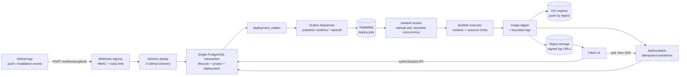
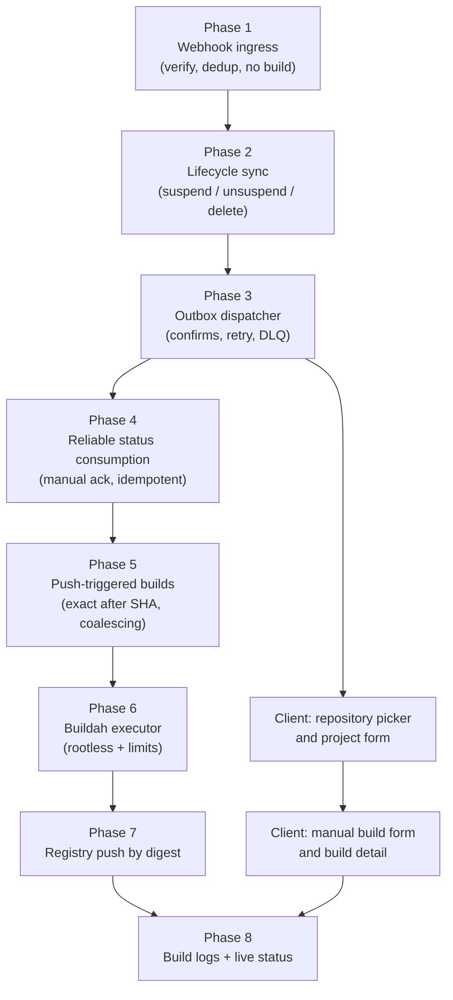

# Projected Direction

> Where Zero-DevOps is heading, why, and in what order. This is the roadmap companion to
> [`architecture.md`](architecture.md), which describes the system as it exists today.

Updated: from the current state of `server/`, `worker-server/`, `client/`, and `schemas/`.

---

## 1. The end state

A developer connects a GitHub App, selects a repository, and never touches build
infrastructure again. Every push produces an immutable, digest-addressed OCI image with a
durable build record and retrievable logs.

Compared to today, four things change: builds are triggered by webhooks rather than only
manually, delivery goes through an outbox instead of a direct publish, builds run under
Buildah rather than Docker, and the output is a registry digest rather than a local tar.

---

## 2. Gap between now and then

| Concern | Today | Target |
| --- | --- | --- |
| Build trigger | Manual `POST /projects/:id/builds` only | Manual plus signed GitHub webhook push events |
| Job delivery | Direct RabbitMQ publish from the request path | Transactional outbox with publisher confirms |
| Status handling | Auto-ack consumer | Manual ack, idempotent transitions, retry and DLQ |
| Build engine | Docker daemon, no resource caps | Rootless Buildah behind a `BuildExecutor` interface, with CPU/memory/PID/disk limits |
| Build output | `docker save` tar uploaded to Cloudflare R2 | OCI image pushed to a registry, addressed by digest |
| Installation lifecycle | Status column exists, set manually | Driven by `installation` webhook events |
| Repository cache | Redis cache with TTL | TTL plus webhook-driven invalidation |
| Build logs | Worker-side only | Bounded, persisted, retrievable via signed URL |
| Client | Landing page, shell, auth guard | Repository picker, project form, build views, live status |

---

## 3. Sequenced roadmap

Ordered so each phase is independently shippable and never leaves the system in a state where
a partially built feature can trigger a real build.

### Phase 1 — Webhook ingress

Wire the existing parser and stub handler into `main.go`. The route `/webhooks/github` is
already public in middleware, so the remaining work is registration and hardening.

- Read the raw body before any binding, enforce a strict size limit.
- Verify `X-Hub-Signature-256` with constant-time comparison; reject unsigned requests.
- Allowlist events: `push`, `installation`, `installation_repositories`.
- Deduplicate on `X-GitHub-Delivery` against `webhook_deliveries`.
- Return 2xx only after durable acceptance. Never build synchronously in the handler.

Done when a replayed delivery is a no-op and a tampered signature is rejected.

### Phase 2 — Installation lifecycle sync

Map webhook events onto the existing `status` column: `suspend` to `suspended`, `unsuspend`
to `active`, `deleted` to `uninstalled`. Preserve deployment history in every case and block
GitHub-dependent actions when status is not `active`. Treat reinstall as reconnection, so
`StoreInstallation` becomes an upsert rather than a plain insert.

### Phase 3 — Outbox dispatcher

The `deployment_outbox` table already exists. Add the dispatcher:

- Claim pending rows with `FOR UPDATE SKIP LOCKED` so multiple dispatchers are safe.
- Publish persistent messages with publisher confirms; only mark sent after a confirm.
- Exponential backoff with a bounded attempt count, then route to DLQ.

Design detail in [`plan-outbox-dispatcher.md`](plan-outbox-dispatcher.md).

### Phase 4 — Reliable status consumption

Replace the auto-ack status consumer with manual ack. State transitions become idempotent so
a redelivered status message cannot move a terminal deployment backwards. Acknowledge only
after the outcome is durable.

### Phase 5 — Push-triggered builds

With ingress, lifecycle, and delivery reliable, push events can create builds:

- Use the exact `after` SHA from the payload; never resolve the branch tip at build time.
- Key builds by `(repository, ref, commit_sha, configuration_version, trigger)`.
- Coalesce stale generations so rapid pushes do not queue superseded builds.
- Skip builds when the installation is not `active` or the project has webhooks disabled.
- Invalidate the Redis repository cache on `installation_repositories` events. The
  invalidation method already exists and is not yet called.

### Phase 6 — Buildah executor

Introduce a `BuildExecutor` interface and put Buildah behind it, keeping the Docker path as a
fallback during migration.

- Rootless builds, no privileged daemon access.
- Per-job timeout plus CPU, memory, PID, and disk limits.
- Isolated workspace per job with guaranteed cleanup on success and failure.
- Bounded log capture so a runaway build cannot exhaust storage.

Deep design in [`buildah-webhook-worker-architecture.md`](buildah-webhook-worker-architecture.md).

### Phase 7 — Registry publish by digest

Add `ImageStore` and `ImagePublisher` interfaces. Local Buildah storage first, then push to an
OCI registry and record the digest on the deployment. The R2 tar path stays until digest
publishing is proven, then retires.

### Phase 8 — Logs and live status

Persist bounded build logs, expose a build-log endpoint backed by signed URLs, and move the
client from polling to SSE or WebSocket for live status.

### Client track

Runs in parallel from Phase 3 onward: connection screen, cached repository picker, project
form with autoscan command suggestions surfaced for confirmation, manual-build form, and build
detail with status. Polling first, live updates once Phase 8 lands.

---

## 4. Contract policy

`schemas/deploy-jobs-v1.schema.json` is the single source of truth for `deploy.jobs`. V1 is
immutable. None of the phases above introduce a breaking change to it.

If a V2 becomes necessary, it ships alongside V1 for a bounded window: the server publishes
both, the worker consumes both, and V1 retires only after no V1 producers remain. `deploy.status`
stays a deliberately looser contract so status evolution does not force a job-contract bump.

---

## 5. Hardening items

Tracked separately from feature phases because they gate production, not functionality.

- Hash refresh tokens before storage. They are currently stored raw.
- Retire legacy routes: `POST /deploy` currently fails closed with 409, and legacy
  `/integration/scm/github/*` routes coexist with `/integrations/github/*`.
- Tighten error-to-status mapping so auth, SCM, and deployment errors return precise 400,
  401, 404, and 409 responses.
- Finalize worker ack, retry, and DLQ policy.
- Add staging ingress, load testing, and observability validation before rollout.

---

## 6. Definition of done for the current milestone

- A signed push webhook produces exactly one build for the exact `after` SHA.
- A replayed delivery produces no additional build.
- A suspended installation blocks new builds while retaining history.
- A queue outage delays builds but loses none, and recovery drains the outbox.
- Builds run rootless with enforced resource limits and clean up their workspace.
- The client can connect an installation, pick a repository, configure a project, trigger a
  build, and watch it reach a terminal state.

---

## 7. Related documents

- [`architecture.md`](architecture.md) — current and planned architecture with diagrams.
- [`plan-server-12-08.md`](plan-server-12-08.md) — sequenced implementation TODOs.
- [`plan-outbox-dispatcher.md`](plan-outbox-dispatcher.md) — outbox dispatcher design.
- [`buildah-webhook-worker-architecture.md`](buildah-webhook-worker-architecture.md) — webhook and Buildah worker deep design.
- [`deploy-jobs-contract.md`](deploy-jobs-contract.md) — contract rules and versioning.
- [`task2status.md`](task2status.md) — task-to-status mapping.
- [`webhook_todos.md`](webhook_todos.md) — remaining webhook items.
- [`future/`](future) — forward-looking notes on GitHub integration, issues, and webhooks.

---

## Contributors

Developed by [@Parth06102006](https://github.com/Parth06102006) and
[@dkhushi6](https://github.com/dkhushi6).
