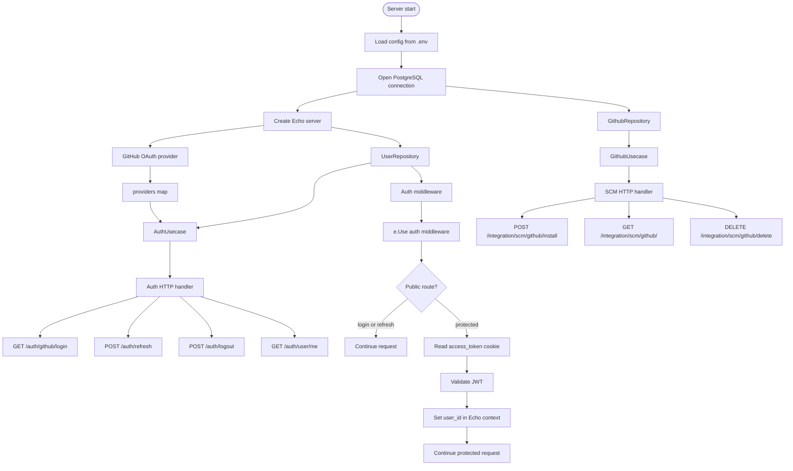

# Zero DevOps Server

Backend service for GitHub OAuth authentication, GitHub App installation tracking, and the upcoming repository deployment flow.

The server is written in Go, uses Echo for HTTP delivery, PostgreSQL for persistence, Viper for configuration, and follows a clean architecture style:

- `domain`: core entities and interfaces
- `authorization/auth`: login, refresh, logout, current-user logic
- `authorization/user`: PostgreSQL user repository
- `integrations/scm`: GitHub App installation APIs
- `app`: dependency wiring and server startup

## Current Implementation

The backend currently supports:

- GitHub OAuth login through a callback-style `GET /auth/github/login`
- App-owned access and refresh JWT cookies
- Refresh-token rotation
- Logout and cookie clearing
- Current-user lookup
- Auth middleware that reads `access_token`, validates it, and stores `user_id` in Echo context
- GitHub App installation storage for the authenticated user
- GitHub App installation lookup and local disconnect/delete

Status tracking and GitHub webhooks are documented as future work and are not part of the current implementation.

## Runtime Flow



## Auth APIs

Base URL locally depends on `SERVER_ADDRESS`. Example: `http://127.0.0.1:8750`.

| Method | Path | Auth | Purpose |
| --- | --- | --- | --- |
| `GET` | `/auth/github/login?code=...` | Public | GitHub OAuth callback. Creates app cookies. |
| `POST` | `/auth/refresh` | `refresh_token` cookie | Rotates access and refresh tokens. |
| `POST` | `/auth/logout` | `access_token` cookie | Clears stored refresh token and auth cookies. |
| `GET` | `/auth/user/me` | `access_token` cookie | Returns the current user. |

GitHub OAuth redirects with a `GET` request, so `/auth/github/login` is intentionally registered as `GET`.

## GitHub App APIs

| Method | Path | Auth | Purpose |
| --- | --- | --- | --- |
| `POST` | `/integration/scm/github/install?code=...` | `access_token` cookie | Installs/stores GitHub App installation for current user. |
| `GET` | `/integration/scm/github/` | `access_token` cookie | Returns stored installation for current user. |
| `DELETE` | `/integration/scm/github/delete` | `access_token` cookie | Removes stored installation from local DB. |

The delete route currently means local disconnect. It removes the installation record from this app's database. GitHub-side uninstall/suspend synchronization is planned later through webhooks.

## Key Functions

Auth:

- `NewAuthHandler`: registers auth routes.
- `Login`: exchanges GitHub OAuth code through the auth usecase, then writes `access_token` and `refresh_token` cookies.
- `Refresh`: reads `refresh_token`, rotates tokens, and rewrites cookies.
- `Logout`: validates `access_token`, clears the stored refresh token, and deletes cookies.
- `GetUser`: returns the current authenticated user.
- `NewAuthUsecase`: wires user repository and OAuth providers.
- `HandleOAuthCallback`: exchanges provider code, creates or loads local user, generates app tokens.
- `RefreshToken`: validates refresh JWT and rotates persisted refresh token.
- `AuthMiddleware`: validates access token and stores `user_id` in request context.

GitHub SCM:

- `NewSCMHandler`: registers GitHub App installation routes.
- `Installation`: reads GitHub App install code and stores installation data for the current user.
- `GetInstallation`: returns the current user's stored GitHub installation.
- `DeleteInstallation`: deletes the current user's local GitHub installation record.
- `NewGithubAppUsecase`: wires GitHub repository into the SCM usecase.
- `InstallGithubApp`: exchanges GitHub code, fetches user installations, stores matching app installation.
- `GetGithubAppInstallation`: loads installation by local user ID.
- `DeleteGithubApp`: deletes installation by local user ID.

## Configuration

The server expects a `.env` file in `server/`.

Minimum local keys:

```env
DATABASE_HOST=127.0.0.1
DATABASE_PORT=5432
DATABASE_USER=postgres
DATABASE_PASS=password
DATABASE_NAME=zero_devops
SERVER_ADDRESS=:8750
JWT_SECRET=local-secret
```

Common GitHub/OAuth keys:

```env
OAUTH_GITHUB_CLIENT_ID=...
OAUTH_GITHUB_CLIENT_SECRET=...
OAUTH_GITHUB_REDIRECT_URL=...
GITHUB_APP_CLIENT_ID=...
GITHUB_APP_CLIENT_SECRET=...
GITHUB_APP_ID=...
ACCESS_TOKEN_EXPIRY=1
REFRESH_TOKEN_EXPIRY=720
IS_PRODUCTION_ENV=false
context.timeout=2
```

## Local Development

Run commands from the `server/` folder.

Start PostgreSQL:

```powershell
docker compose up -d
```

Run the server:

```powershell
go run ./app
```

Run tests with a repo-local Go cache on Windows:

```powershell
$env:GOCACHE = Join-Path $PWD '.gocache'
go test ./... -v
```

Run focused packages:

```powershell
go test ./authorization/auth/delivery/http -v
go test ./authorization/auth/usecase -v
go test ./integrations/scm/delivery/http -v
go test ./integrations/scm/github/usecase -v
go test ./integrations/scm/github/repository/pgsql -v
```

## Next Implementation

The next implementation should move from "GitHub App is installed" to "the app can inspect deployable repositories."

Recommended first API:

```text
GET /integration/scm/github/repos
```

Expected flow:

1. Require `access_token` cookie.
2. Read `user_id` from auth middleware context.
3. Load the stored GitHub installation for that user.
4. Create a GitHub App installation access token from the stored `installation_id`.
5. Call GitHub to list repositories available to that installation.
6. Return repository metadata to the frontend.
7. Let the user select a repository for the deployment flow.

After repository listing works, the next natural steps are:

- store the selected repository for a deployment/project
- fetch repository branches and default branch
- prepare clone/build/deploy orchestration
- add GitHub webhooks later for push, uninstall, suspend, and repository events

See `server/docs/future/issues.md` for prioritized future work.

